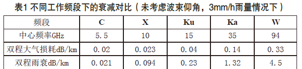
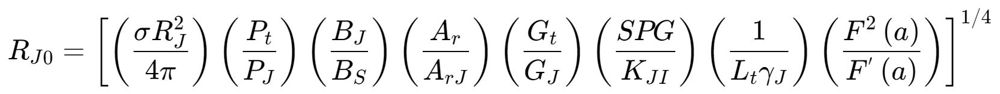
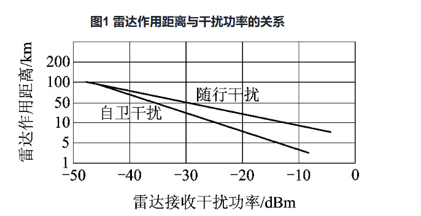
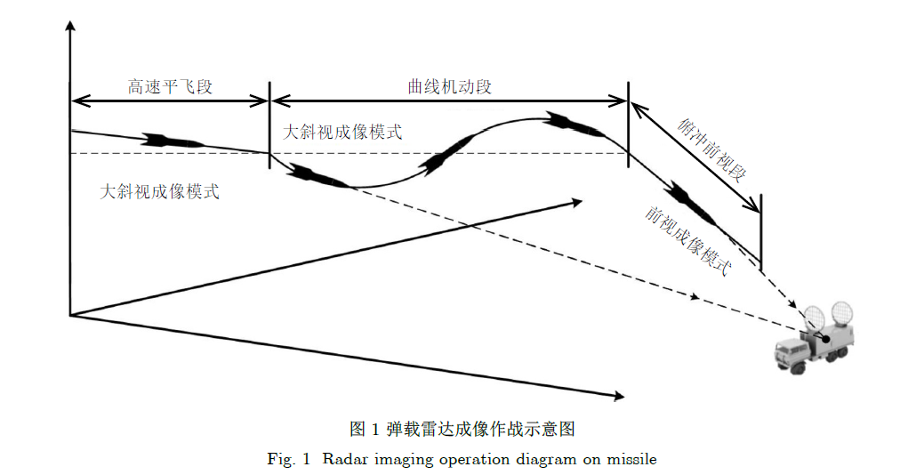
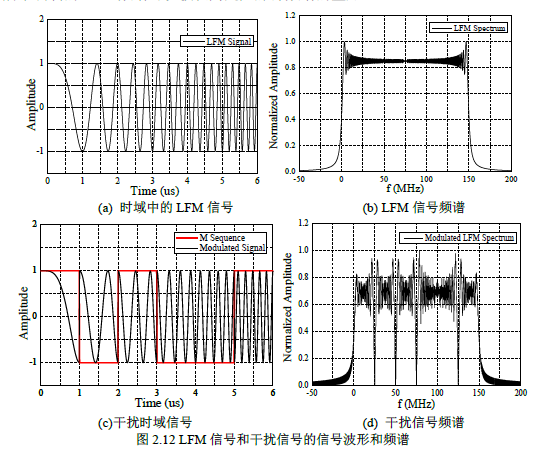
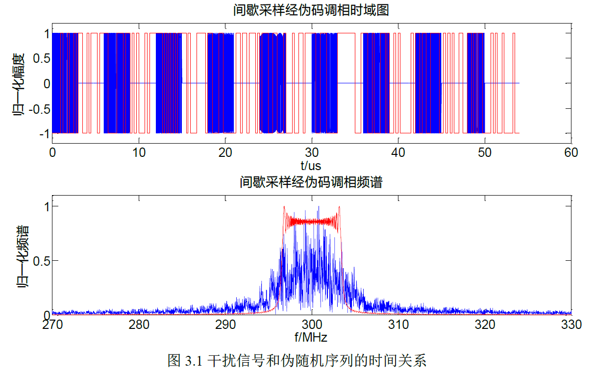

# 弹载雷达优势区域和突防干扰

<!-- **要求**
* **弹载雷达：**
导引头装载，对雷达平台要求不高；
* **优势区间：**
弹载雷达在一定区域内的优势，比如距离区间、速度区间、频率区间
* **导弹突防干扰：**
导弹突破防御时对探测雷达发射的干扰 / 接收到敌方雷达的干扰以及抗干扰技术 -->
[TOC]

## 优势区间

### 雷达作用距离

#### 不同频段雷达作用距离[^8]

根据雷达方程，主动雷达导引头在无杂波区的最大作用距离为：
$$雷达方程$$
式中，Pt 为雷达发射峰值功率，Gt 和Gr 分别为导引头天线发射增益和接收增益，λ为工作波长，σ为探测目标的雷达截面积（RCS），k为玻尔兹曼常数，T0为标准室温，B为接收机带宽，Fn为接收机的噪声系数，D0为检测因子，Ls为系统总损耗。
从雷达方程中可以看到，工作频率的选择对导引头作用距离的大小有着重要的影响，并体现在多个计算参数中。峰值功率Pt由导引头天线阵面可容纳的天线单元数以及单元峰值功率共同决定，其中最大可容纳天线单元数和工作波长λ直接相关。雷达工作频段越高，波长越小，相同天线阵面面积可容纳的天线单元数就越多（天线单元间距约半个波长）。但单个组件的峰值功率并没有随着频率的增高而线性变大，因此峰值功率和工作频段之间不是简单的正反比关系。随着雷达收发组件技术的发展，峰值功率也在逐步变大。
雷达导引头工作在不同的频段，电磁波传播中受到的大气衰减和雨衰也都不同。为了尽可能减小损耗对作用距离的影响，工作频段常选择在大气衰减较小的电磁波“传播窗口”周围（Ka频段，中心频率选择为35GHz；W频段，中心频率选为94GHz）。下表[^8]给出了常用的几种导引头工作频段下大气衰减的对比。

#### 有源干扰下火控雷达作用距离[^10]
干扰功率：
$$P_{Jr} = \frac{P_J G_J A_r N_J}{4 \pi R_r^2 L_r} \left( \frac{B_s}{B_J} \right) F'(a)$$
信干比：
$$\begin{aligned}\frac{S}{J}& = \frac{P_{sp}}{P_{Jr}} = \\ &\left( \frac{\sigma}{4 \pi} \right) (SPG) \left( \frac{P_t}{P_J} \right) 
\left( \frac{B_J}{B_s} \right) \left( \frac{A_r}{A_{rJ}} \right) \left( \frac{G_t}{G_J} \right) 
\left( \frac{R_J^2}{R^4} \right) \left( \frac{1}{L_t \gamma_J} \right) \left( \frac{F^2(a)}{F'(a)} \right)\end{aligned}
$$
F′(a)—— 干扰功率的传输衰减。F(a)—— 传播损耗因子;

##### 随行干扰作用距离估算[^10]
所谓随行干扰，就是在敌目标周围的随行飞行器上，装载大功率干扰设备对己方雷达进行电子干扰，其目的是专门用来掩护敌目标飞行器。由于随行干扰靠近被干扰雷达，因此，具有对主瓣干扰的可能性，所以干扰效果较好。实施随行干扰时，当干扰信号功率$P_{Jr}$大大超过内部噪声功率$P_N$情况下，$P_N$在计算中可不作考虑，在估算随行干扰模式下的发现距离时，其中的主要因素当属$P_{sp} /P_{Jr}$的比值大小。对搜索雷达而言，$P_{sp} /P_{Jr}$取决于发现概率与虚警概率; 对跟踪雷达而言，则由截获概率和跟踪精度确定［6］。因此，如果必须符合前面所限定的$(P_{sp} /P_{Jr})min$，则$(P_{sp} /P_{Jr})min = K_{JI}$，$K_{JI}$就是接收机处理信号时的最小目标信号与干扰信号之间的比值。将$K_{JI}$与上述式子结合在一起，便可估算出随行干扰环境中火控雷达的作用距离计算模型。

##### 自卫干扰作用距离计算[^10]
如果敌目标飞行器自行携带干扰设备对己方火控雷达实施电子干扰，那么这种干扰模式就称作自卫干扰，这种情况时，$R_J=R_{J0},A_r=A_{rJ},F(a)=$ $F^{\prime}(a)$,把上述三组参数等式在上式交换化简， 即可导出敌目标飞行器实施自卫干扰情况下的火控雷达作用距离估算模型：
$$R_{J0}\:=\:\left[\:\left(\frac{\sigma}{4\pi}\right)\left(\frac{P_{t}}{P_{J}}\right)\left(\frac{B_{J}}{B_{S}}\right)\left(\frac{G_{t}}{G_{J}}\right)\left(\frac{SPG}{K_{JI}}\right)\left(\frac{1}{L_{t}\gamma_{J}}\right)F\left(a\right)\:\right]^{1/2}$$

#### 空空导弹跟踪干扰源时的作用距离
当主动雷达导引头受到敌噪声压制干扰而无法正常检测跟踪目标时，对带有干扰源的目标，导引头可转入眼踪干扰源状态，实现干扰寻的(HOJ)攻击模式。
目标机带自卫干扰时，$R=R_i$,$G_t=G_t^{\prime}$ ,导引头接收机内总干扰功率$P_J$。
进入导引头接收机内的自卫干扰信号功率密度为

$$N_{rj}=\frac{P_jG_j\cdot G'_t\cdot\gamma_j\cdot\lambda^2}{K_g\cdot(4\pi R)^2\cdot L_r\cdot B_j}$$

式中，k$_{\mathrm{g}}$为导引头抗干扰电路的抗干扰改善因子。
当干扰功率$\mathrm{P}_\mathrm{j}$与回波信号功率$\mathrm{P}_\mathrm{s}$同时进入导引头接收机，检测前回波信号与干扰功率比为

$$\begin{aligned}\frac{S}{J}&=\frac{P_tG_t^2\lambda^2\cdot\sigma\cdot d\cdot D_{av}}{(4\pi)^3\cdot R^4\cdot NJ\cdot B_n\cdot L}=\\&\frac{P_tG_t^2\lambda^2\cdot\sigma\cdot n\cdot D_{av}}{(4\pi)^3\cdot R^4\cdot N_J\cdot B\cdot L}\end{aligned}$$

式中：n为导引头对目标回波的相参积累数；B为导引头接收机带宽。
设K j为干扰压制系数，则当$S/J=1/K_J$时，对应的目标距离$R_\mathrm{jm}$即为主动雷达导引头在干扰条件下的烧穿距离。

$$R_{jm}=\left[\frac{P_tG_t^2\lambda^2\cdot\sigma\cdot n\cdot\overline{D}_{av}KJ}{(4\pi)^3\cdot N_J\cdot B\cdot L}\right]^{1/4}$$

则有：

$$R>R_{jm}\cdots\frac JS>K_J\text{有效干扰压制区}\\R=R_{jm}\cdots\frac JS=K_J\text{有效压制边界}\\R<R_{jm}\cdots\frac JS<K_J\text{烧穿暴露区}$$

在有效干扰压制区，当自卫干扰机辐射功率足够大，满足下式时，

$$\frac{P_{rJ}}{P_{n}+P_{N}}=\frac{N_{rj}}{N_{n}+N_{d}}\geq D_{J}$$

主动雷达导引头能可靠地截获和跟踪干扰源目标，即：

$$\frac{N_{rj}}{N_n+N_d}=\frac{P_jG_j\cdot G_t\cdot\lambda^2\cdot\gamma_j}{K_g\cdot(4\pi R_j)^2\cdot L_r\cdot B_j\cdot(KT_s+N_d)}\geq D_J$$

则可得导引头在热噪声和地杂波背景中跟踪自卫干扰源的最大距离为

$$R_{j\max}=\left[\frac{\frac{P_j}{B_j}\cdot G_j\cdot G_t\cdot\lambda^2\cdot\gamma_j}{(4\pi)^2\cdot(kT_s+N_d)\cdot D_J\cdot K_g\cdot L_r}\right]^{\frac12}$$

式中：$P_{j}/B_{j}$为干扰机发射功率密度；$D_{j}$为导引头跟踪干扰源的检测识别系数。
当导引头被动跟踪干扰源时，角跟踪误差$σ_\mathrm{\Theta t}$与接收机内的干扰功率和机内热噪声功率与地杂波功率和的比值的平方根成反比,即：
$$\sigma_{\theta t}=\frac{\theta_{0.5}}{K_c\sqrt{\frac{P_{rJ}}{P_{n+P_N}}}}=\frac{\theta_{0.5}}{K_c\sqrt{\frac{N_{rj}}{N_{n+N_d}}}}$$

式中，K_c为误差斜率。

### 成像雷达工作模式

#### 中段：大斜视成像模式

传统SAR成像技术多应用于星载成像和机载成像，主要通过平飞小斜视角观测实现不同时刻散射信息的最大累积，以获得较高的方位分辨率。然而弹载成像主要服务于匹配制导和巡航等雷达平台作战功能，并以目标打击为最终目的，因此传统平飞小斜视角不再适用于弹载成像，同时也无法完成远程目标的持续探测任务。
为实现高速突防目标打击，导弹需要具备曲线运动轨迹，完成弹道调整、主动规避和突防任务，并且实现雷达始终精确跟踪所选目标或区域。因此曲线机动阶段的弹载成像需要具备曲线运动轨迹、高速高机动和大斜视等特性条件。一方面，与传统直线匀速轨迹成像相比，伴有高速高机动特性的曲线轨迹会明显地改变雷达回波的信号频谱表征，使得信号处理方式也产生较大变化，最终导致相位信号模型表征模型失配。另一方面，为满足远程目标探测制导需求，弹载SAR成像采用的大斜视角成像模式使得回波信号距离-方位耦合严重加剧，导致传统小斜视成像算法难以有效解耦，残余的距离-方位耦合分量具有较强的二维空变性。此外，在大斜视成像模式下，距离-方位的解耦后的多普勒中心残留项会随着距离单元变化，最终影响方位的聚焦。因此，斜距表征失真校正、距离-方位有效解耦合和多普勒空变参数校正是曲线机动阶段成像需要研究的关键问题。[^6]

#### 末端俯冲：前视成像模式

由于导弹正前方区域距离与多普勒分辨特性方向一致，且存在多普勒对称模糊现象，传统斜视合成孔径成像技术无法获取前视区域的二维高分辨图像，开展寻的式制导工作。此外，弹体在成像过程中保持斜视观测，在末制导阶段，必须由斜视姿态转换至前视姿态，才能实现对目标有效识别、精准打击的作战需求。传统的雷达前视成像方法如多普勒波束锐化(Doppler Beam Sharpening, DBS)然能够实现前视锐化显示，由于天线方向图的能量分布随机不集中和天线低通滤波的特性，导致作用威力受限以及回波目标的高频信息存在缺失，要实现雷达方位向高分辨，人们需要从回波数据提供的少量信息中求解成像场景中的大量信息，病态问题的存在导致成像方位分辨率受限。实孔径雷达受限于信号本身和天线能力，在机动平台上难以获得令人满意的前视分辨。因此，如何实现雷达正前视区的高分辨成像，正成为弹载雷达成像技术中亟需解决的难题。[^6]几种可行的雷达前视成像技术，分别是微波关联成像技术、扫描雷达解卷积成像技术、协同前视雷达成像技术。

##### 末端制导雷达工作距离[^9]

近年来，随着现代电子技术及精确制导技术的发展，毫米波技术成了国际上的研究热点。从国外精确制导技术在毫米波领域迅速发展的过程中可以看出，研制质量轻、体积小的毫米波导引头是精确制导的关键。毫米波雷达制导兼有微波制导和红外制导的优点，在大气层内，毫米波四个主要传输窗口（３５、９４、１４０和２２０ＧＨｚ），虽较微波对云、雨引起的衰减要大一些，但毫米波系统体积小、重量轻、易于高度集成化和系统化，而且频带宽、分辨率高、敌方难于截获、抗干扰性能强；与红外制导相比则分辨率差一些，但通过烟、雾、灰、尘的能力强，具有较好的全天候战斗能力。因此，毫米波制导系统已成为精确制导（特别是寻的制导系统）的主要发展方向之一。
但是由于大气的吸收和衰减，即使在气候条件较好时，毫米波雷达导引头的作用距离也只有１０～２０ｋｍ。当有云、雾和雨时，作用距离还将减小，而且大气损耗随频率增高而增大。这样出现的一个问题就是主动式毫米波导引头在距
离目标较近时受目标角闪烁噪声影响较大，特别是使用窄波束（采用毫米波段）并要攻击大目标（如舰船等）时，角闪烁随着距离的减小而逐渐增大，引起雷达瞄准点漂移，严重影响测角精度，甚至使雷达不能精确制导。[^9]

##### 末端制导毫米波雷达成像工作距离[^11]
忽略电磁波在大气中的传播衰减，雷达作用距离为：

$$R_{\max}=\left(\frac{\sqrt{M}P_{t}\eta G_{t}G_{r}\lambda^{3}\sigma^{0}\rho_{gr}}{2(4\pi)^{3}kT_{0}F_{n}L_{s}\nu\cos\theta\bullet SNR}\right)^{\frac{1}{3}}$$

$M$为独立视数，可知采用 2 视或 4 视对于雷达作用距离的提升很小，且单帧图像作多视处理是以降低图像分辨率为代价的，而多帧之间多视叠加流程复杂且容易出现失真。
$P_t$为发射峰值功率。
$\eta$为信号占空比，$\eta=T_pPRF,T_p$为脉宽，$PRF$脉冲重复频率，占空比的设计至关重要，不能太低，需保证$T_p$满足距离向匹配滤波大时宽带宽积的假设，也不能过高， 过高将导致系统产生大量热量，在弹载环境下，热量无法发散，影响系统工作甚至出现死机，一般在工程设计中要求占空比不高于 30%。
$G_{t}$和$G_r$分别为天线发射和接收增益，一般天线发射与接收增益相同。
$k$ 为玻尔兹曼常数，其值为 1.38e-23 J/K; $T_0$为标称温度(290 K); $\lambda$为雷达工
作波长；
$\sigma^{0}$为目标后向散射系数，用来衡量分布目标对电磁波的散射能力，又称为归一化雷达散射截面积(Normalized RCS, NRCS), 无量纲，$\sigma^0=\sigma/\rho_{gr}/\rho_{ga}$,其中$\rho_{gr}$和$\rho_{ga}$ 分别为地平面距离向和距离横向分辨率；对于点目标的电磁散射能力，用$\sigma$衡量， 称为目标的雷达散射截面积(Radar Cross Section, RCS),单位：平方米，在以角反等点目标为照射目标雷达作用距离时，计算公式应为：

$$R_{\max}=\left(\frac{\sqrt{M}P\eta G_{t}G_{r}\lambda^{3}\sigma}{2(4\pi)^{3}kT_{0}F_{n}L_{s}\nu\cos\theta\bullet SNR\rho_{ga}}\right)^{\frac{1}{3}}$$

输出端的值，所以此处的收发前端损耗不包含双工器的损耗；信号处理造成的信噪比损失则主要包括距离脉压损失和方位相干积累损失两部分。
$\nu$为导弹飞行速度，$\theta$为波束斜视角，即波束指向矢量与速度矢量夹角的余角。SNR 为图像信噪比，一般根据后续图像处理应用需求来定。令$SNR_{0}=0dB$ ,可以得到一个归一化后向散射系数，记为$NE\sigma^0$,表示最低可检测目标后向散射系数。
实际应用中应考虑大气双程传播衰减、云层衰减、雨雾衰减等，尤其对毫米波雷达来讲，这些衰减不容忽视。其中大气衰减主要指对流层水蒸气与氧气对电磁波的吸收引起的衰减。记 $\delta _n($dB/ km) 为电磁波在某介质中传播过程中的衰减系数，$\Delta R_n$为电磁波在该介质中单程传播距离，则实际得到的图像信噪比为

$$SNR^{'}=SNR-2\sum_{n=1}^{N}\delta_{n}•\Delta R_{n}$$

在参数设计阶段就应考虑传播损耗，以满足实际工程需求。

## 突防干扰

### 干扰技术

#### 弹载有源干扰机[^1]
为了掩护弹道导弹突防， 我们还可以研制一系列专用超小型化有源干扰机， 这些装备工作在L,S,C,X波段，装配在导弹的组合舱内，伴随着导弹飞行。在大气层外的弹道部分， 干扰设备从导弹中分离出来， 这些干扰机在一定高度开机工作， 在一定频率范围内实施干扰，掩护导弹飞行。这些干扰设备都属于一次性使用的干扰机或称之为投掷式干扰机，要求小巧、性能价格比高、投放方便，能与弹头一起飞行，掩护弹头突防。目前常用的干扰机主要有以下几种：
**1.噪声干扰机**
噪声干扰机是用途很广泛的一种干扰机，主要用来掩盖和压制各种雷达信号，它无需知道被干扰系统的详细特性，只需知道被干扰雷达部分性能参数（如工作频率）,就可以实施有效压制干扰。噪声干扰机对预警雷达压制干扰的基本依据是干扰雷达接收机的干噪比。
从理论上讲，只要干扰功率足够强，噪声干扰机就可以速盖或压制任何结构或形式的有用信号以及目标回波信号，尤其是白正态噪声含有不确定成分最高，遮盖性能最好，从而使雷达回波信号被淹没或切割，使得雷达难以发现目标。因而,在弹头RCS减缩的基础上，实施噪声干扰机是对防御雷达多个作战环节跟踪、识别、拦截等进行有效雷达对抗的重要突防手段之一。
**2.欺骗式干扰机**
在弹道导弹突防时，针对反导导弹武器系统的脉冲或连续波制导以及跟踪雷达的信号特性，我们还可以使用欺骗式干扰机进行干扰。欺骗干扰机的任务是将接收到的雷达信号予以一定的调相、幅度调制或调频处理后发射一组假信号，在预警雷达系统内形成一组假目标，或者有针对性地改变参数，引导搜索雷达在距离、速度或角度上踉踪时偏离参数,最终使搜索雷达在距离、速度和角度上受到欺骗。
欺骗式干扰机的特点是干扰能董利用方面比较好，用它干扰一部雷达所需的能量比噪声干扰机小得多。这在密集的威胁环境中尤为重要，因为有可能在用一部应答式干扰机的同时还能干扰多部雷达。欺骗式干扰比噪声干扰有效的主要原因是欺骗式干扰机的干扰信号波形与雷达接收机匹配。
**3.导引头干扰机**
一般情况下，由于导弹防御系统搜索雷达的跟踪、测角精度难以满足拦截目标的精度要求,因而导引头广泛地应用于反导导弹。当反导导弹接近目标时,导引头对来袭目标进行精确测量,然后调整飞行姿态，对来袭目标进行拦截。因此,设计一种针对导引头的干扰机,在飞行中段和末端，可对反导导弹导引头进行距离欺骗、角度欺骗与引偏,甚至使导引头致盲，进而使反导导弹拦截扑空,达到导弹突防的目的。

#### 导引头受到的干扰[^7]
线性调频单脉冲雷达采用和差比幅法可以获取目标的角度信息，利用回波调制的相位信息和多普勒频移信息可以估计目标的距离和速度。对于雷达的干扰也主要集中在对于探测角度、距离和速度等方面，造成虚假的雷达制导信息；或者进行饱和压制，使雷达无法正常工作。本文按照干扰对于雷达影响的方面进行分类：一是质心干扰类；二是雷达有源诱饵干扰；三是饱和压制干扰。质心干扰简述如下，压制干扰上文已描述，下文主要描述有源诱饵干扰（欺骗干扰）。
**质心干扰：**
舰船目标在运动过程中，通过释放角反射体、箔条云等舷外无源干扰；或通过电子支援系统释放舷外有源诱饵，会在舰船附近形成具有较大RCS 的假目标，造成角度欺骗。

**欺骗干扰：**
密集假目标，距离拖引、速度拖引、距离-速度二维拖引
* 密集假目标干扰：
雷达密集假目标属于冲淡式干扰。干扰回波经雷达接收端匹配滤波和相参积累等信号处理后，产生多个虚假目标围绕在真实目标周围，且信噪比要高于真实目标回波，使得真实目标被冲淡，雷达的检测概率降低。
假设第$i$个假目标距离为$R_i$ ，其回波幅度为$A_i$ ，干扰机对发射信号进行延时和幅度调制后叠加，那么在密集假目标干扰下，雷达接收端接收到的含n 个假目标的回波信号可以表示为
$$s_{\mathrm{r}}(t)=\sum_{i=0}^{n}A_{\mathrm{i}}\cdot\exp\lceil j2\pi(f_{c}+f_{d})(t-\frac{2R_{\mathrm{i}}}{c})\rceil$$

* 距离拖引干扰：
雷达在搜索到目标后转入跟踪状态，在距离维上产生含真实目标回波的距离波门。干扰机在捕获雷达信号后进行延迟转发，并且在转发过程中，干扰回波脉冲会以匀速或匀加速状态进行运动，由于干扰回波能量大于真实目标，使得雷达接收机的距离门会随着假目标移动，在经过一段时间拖引后，距离门内失去真实目标，此时干扰信号回到真实目标位置，造成真假目标全部丢失，雷达重新由跟踪状态转入搜索模式。
接收到的来自干扰机调制延迟后的距离拖引信号可以表示为
$$s_\mathrm{r}(t)=A_\mathrm{j}\exp\left[j2\pi(f_\mathrm{c}+f_\mathrm{d})(t-\frac{2R(t)}{c}-\Delta t_\mathrm{j})\right]$$
其中$\Delta t_j$表示距离拖引时间，以匀速拖引距离欺骗为例，分为三个阶段，停拖期、拖引期以及关闭期，拖引时间可以表示为
$$\Delta t_{\mathrm{j}}=\begin{cases}0&t\leq t_{\mathrm{j1}}\\v(t\mathrm{-}t_{\mathrm{j1}})&t_{\mathrm{j1}}<t\leq t_{\mathrm{j2}}\\\text{干扰关闭}&t_{\mathrm{j2}}<t\leq T_{j}&\end{cases}$$
v 为距离拖引速度.

* 速度拖引干扰
电子支援系统在捕获雷达发射信号后进行多普勒频率的调制转发，产生速度拖引诱饵假目标。假目标回波信号的多普勒频率会以匀速或者匀加速状态进行变化，由于干扰机在转发过程中的信号能量大于真实回波，使得雷达接收机的多普勒门会随着回波信号进行相应的匀速、匀加速运动，在经过一段时间拖引后，多普勒门偏离真实多普勒频率位置，此时干扰信号多普勒信息回到真实目标位置，导致多普勒目标丢失，雷达重新由跟踪状态转入搜索模式。
干扰信号表示为：
$$s_\mathrm{j}(t)=A_\mathrm{j}\exp\left[j2\pi(f_\mathrm{c}+f_\mathrm{d}(t))(t-\frac{2R(t)}{c})\right]$$

* 距离速度拖引联合干扰：
$$S_j(t)=A_\mathrm{j}\exp\left[j2\pi(f_\mathrm{c}+f_\mathrm{d}(t)+f_\mathrm{dj}(t))(t-\frac{2R(t)}{c}-\Delta t_j)\right]$$

#### 有源压制干扰[^2]
实现有源压制干扰,要求在敌方雷达开机搜索时,向敌方雷达中注入强干扰信号,使得真实目标回波信号被干扰淹没,从而使敌方雷达无法发现真实目标,即降低突防导弹的被发现概率或者缩短被发现距离。考虑到弹载干扰机在实施有源干扰时,目标雷达在同样的距离上对导弹进行探测,干扰与探测在距离和方向上有相关性,干扰方程可以相应进行简化。
**导弹的回波信号：**
$$P_{_{\mathrm{rs}}}=\frac{P_{_{t}}\sigma}{2\pi R_{_{t}}^{2}(1-\mathrm{cos}\vartheta)}\cdot\frac{A}{4\pi R_{_{t}}^{2}}$$

**雷达接收的弹载干扰机干扰信号**为一次辐射信号，功率为：

$$P_{_{\mathrm{rj}}}=\frac{P_{_{\mathrm{j}}}A}{4\pi{R_{_{t}}}^{2}}$$

简化的雷达接收机机干扰信号与导弹反射回波信号**功率比**为：

$$\frac{P_{\text{rj}}}{P_{\text{rs}}}=\frac{P_{\text{j}}}{P_{\text{t}}}\cdot\frac{2\pi R_{\text{t}}^{2}(1-\mathrm{cos}\vartheta)}{\sigma}$$

**干扰功率需求：**

为使弹载干扰有效,雷达接收的干扰信号功率必须大于导弹反射回波信号功率,即干信比必须大于1,且干信比越大,压制干扰效果越好。
$$\frac{P_{_\mathrm{rj}}}{P_{_\mathrm{rs}}}=\frac{P_{_\mathrm{j}}}{P_{_\mathrm{t}}}\cdot\frac{2\pi R_{_\mathrm{t}}^{2}\left(1-\mathrm{cos}\vartheta\right)}{\sigma}\geqslant1$$
$$P_{_\mathrm{j}}\geqslant\frac{P_{_\mathrm{t}}\sigma}{2\pi R_{_\mathrm{t}}^{2}\left(1-\mathrm{cos}\vartheta\right)}$$

**干扰起始距离：**
$$R_\mathrm{d}=4.12(\sqrt{H}+\sqrt{h})$$

**雷达烧穿距离确定：**
“烧穿距离”为弹载干扰机的干扰失效距离。随着导弹持续抵近目标,弹目距离Rt不断减小,敌雷达接收的导弹反射回波信号功率不断增大。虽然接收的干扰信号功率也随之增大,但增大的速度不一致。当弹目距离$R_t$ 减小到一定值时,出现干信比小于1的情况。此时,干扰信号将不能有效掩盖导弹反射回波信号,弹载压制干扰失效。烧穿距离以接收的干扰信号功率等于导弹反射回波信号功率这一临界距离确定,以$R_t'$表示:
$$R_{t}^{\prime}=\sqrt{\frac{P_{t}\sigma}{P_{j}2\pi(1-\mathrm{cos}\vartheta)}}$$

优势区间：
$$ R_d \le R \le R_t' $$
**采用窄波束并瞄准敌雷达实施干扰:**
雷达接收的弹载干扰机干扰信号虽然为一次辐射信号，但是考虑的是弹载干扰机向球面空间辐射能量，干扰机能量未集中瞄准敌雷达照射。达成压制干扰效果需要增大干扰机的辐射功率，在弹载干扰机通常瓦级的干扰功率下，干扰效果必然受到限制。如果弹载干扰机能够根据探测到敌雷达辐射信号的方向，瞄准敌雷达实施窄波束集中压制干扰，干扰机将由向球面空间转换为向球冠空间辐射能量，则敌雷达接收的弹载干扰机干扰信号功率为：

$$P_{_{\mathrm{rj}}}=\frac{P_{_{\mathrm{j}}}A}{2\pi R_{_{\mathrm{t}}}^2(1-\mathrm{cos}\theta)}$$

式中：$\theta$为干扰机辐射波束半宽。
采用窄波束瞄准改进后的干信比为；

$$\frac{P_{_{\mathrm{rj}}}}{P_{_{\mathrm{rs}}}}=\frac{P_{_{\mathrm{j}}}}{P_{_{\mathrm{t}}}}\cdot\frac{4\pi R_{_{\mathrm{t}}}^{2}(1-\mathrm{cos}\vartheta)}{(1-\mathrm{cos}\theta)\sigma}$$

#### 相位调制LFM干扰信号设计[^5]
脉冲压缩雷达拥有大的时间带宽积，使得LFM 雷达获得较高的分辨率以及较大的工作距离。因此，它已被广泛应用于现代雷达系统中，以提高检测距离和距离分辨率。合成孔径雷达（SAR）或逆合成孔径雷达（ISAR），通过利用LFM信号的高分辨率等特性进行目标识别。回波经过匹配滤波或脉冲多普勒PD 处理后，雷达接收机可以获得较大的处理增益。卷积噪声干扰信号由于与雷达信号不相关原因容易被识别。
LFM 雷达的干扰方法相对成熟，干扰技术主要包括压制式干扰技术和欺骗式干扰技术。两种技术在不同实际环境下干扰效果不同，同时它们以消耗雷达资源，并且显着降低雷达的检测性能。然而，传统的RF 噪声在对抗LFM 雷达时需要较大的干扰功率。噪声干扰通过传输噪声或类噪声的信号，用来抑制回波，防止雷达检测真实目标。它不需要太多的雷达信号信息，易于实现。但是由于干扰信号与雷达信号不一致，所以需要更多能量来实现更好干扰效果。根据线性调频雷达信号的特点，提出了一种称为卷积干扰的新型干扰技术。所拦截的雷达信号与视频信号进行卷积，然后重发到敌方雷达。当使用不同的视频信号时，这种干扰方法可以获得多个假目标的欺骗性干扰或遮盖干扰效果，相同时间内所需的干扰功率相对较小。然而，这种干扰方法要求干扰信号带宽等于雷达信号带宽，以实现更好的干扰效应，这在实际应用中非常难以实现。
为了充分利用干扰功率，本文提出了一种基于伪随机码相位调制遮盖干扰新方法。拦截的雷达信号根据伪随机序列进行调制，并重新回传给到敌方雷达，然后获得遮盖式干扰效果。基于用于脉冲压缩结果进行CFAR 门限检测算法采用最小干信比（JSR）准则。给出了关键参数的设计，并分析了实际的干扰效果。
在LFM信号上加上m序列伪随机码相位调制：
$$ s_j(t) = m(t)\cdot rect(\frac{t}{T_p})\exp[j2\pi (f_ct+\frac12 kt^2)] $$
可以看出，对LFM 信号进行相位调制后，相位不连续点出现在时刻$T_c$。图2.12示出了LFM 信号和干扰信号的信号波形和频谱。如图2.12（b）所示，由于图2.12（a）在时域调制的影响发生了相位跳变。在频域中，与图2.12（c）中的LFM 频谱相比，调制信号频谱不如带宽中的起始信号平滑。 LFM脉冲被分成N 个相等短脉冲，每个脉冲被分配一个相位值0 或$\pi$ 。当相邻的短脉冲的相位值时，信号相位是连续的，否则是不连续的。然而，每个短脉冲仍然是带宽为$B /N$的LFM 信号。它导致相间不连续相邻短脉冲之间的间隙

#### ISAR压制干扰-间歇采样联合伪随机调制图像干扰方法[^5]
间歇采样和直接传输散射波干扰（SWJ）合成孔径雷达（ISAR）可以形成多个虚假目标，伪随机序列相位调制扩展了调制信号的频谱。本章给出了一种有源间歇采样压制干扰信号产生方法。干扰机首先对所拦截雷达信号脉冲进行间歇采样，然后进行伪随机码相位调制。这个干扰信号在距离像上形成多个类似噪声的目标，从而实现对ISAR 图像的压制干扰。
基本的干扰思路为：干扰机接收雷达信号后，以$T_s/2$的采样时间进行采样，在下一个$T_s/2$的采样区间里干扰机传输用于保护目标的干扰信号。这个过程在雷达信号整个时间区间内重复，则干扰信号由脉冲的部分元素组成。干扰信号由间歇采样信号产生，在每个采样窗中仅采样雷达信号。也就是说我们看到序列值得改变导致了干扰信号相位发生$\pi$的跳转。干扰信号带宽不连续分布。

#### 一种旋转对称进动目标的ISAR欺骗式干扰信号生成方法[^5]
逆合成孔径雷达（ISAR）能够对空域目标进行高分辨率成像，从而获得目标
结构特征及散射中心分布特性，因此ISAR 雷达被广泛地应用于弹道导弹防御系统中。为了保护弹道目标，如何切实有效地干扰ISAR 雷达成像系统逐渐成为电子对抗中一个研究方向。
由于ISAR 雷达的信号处理增益很高，传统的噪声干扰的发射功率过低，难以实现对成像雷达的有效压制，因此常见的干扰样式多采用欺骗干扰。文献[63]提出了基于数字图像合成技术的ISAR 假目标欺骗干扰方法，选用虚假目标的距离-多普勒图像作为模板，对干扰机截获的雷达脉冲进行幅相调制产生干扰信号。文献[64]研究多假目标欺骗干扰信号产生方法，提出基于DIS 技术多假目标的步进频ISAR干扰方法。文献[65]提出，根据干扰机接收ISAR 信号和目标回波信号之间的相位关系，采用相位补偿调制的方法来实现ISAR 欺骗式干扰。
干扰机在任意时刻的位置，现有的算法都假设是已知或是通过目标搭载的惯性导航和定位系统实时获得。目前一些空载干扰机是作为一个完整的独立系统单独工作，在产生干扰信号之前的几秒就和目标分离，在干扰机上搭载惯性导航和定位系统是不现实的，在这种情况下我们必须考虑采用其他的方式来获得干扰机在任意时刻的位置。此外，当干扰机与目标分离时，初始位置与目标位置相同，其速度和姿态参数已知，根据目标的运动模型，可实时计算干扰机的位置信息[66][67]。
空中目标不仅具有整体的平动，还有目标进动导致的微动。目标结构的不同决定了微动特性的差异，因此目标的微多普勒信息是唯一的，因此在现代ISAR雷达系统中，将目标微多普勒特性作为目标特征来实现对真假目标的识别[68]。对于上述所有ISAR干扰信号生成方法而言，由于未考虑到目标的微动特性，干扰机产生的假目标不具有微多普勒特性，很容易被雷达识别出来。因此，在干扰机产生干扰信号时，必须考虑目标的微动特性[69]。
基于目标进动的假目标干扰信号：
$$\begin{aligned}s_j(t_r,t_a) = &IFFT \biggl\{ S_{T}(f_{r},t_{a})=IFFT\{S_{J}(f_{r},t_{a})\times\sum_{k=1}^{K}\sum_{p=1}^{P_{k}}\biggl[\sigma_{k,p}\\&\times\exp\biggl\{-j4\pi\frac{f_{r}}{C}\Delta R_{k,p}(t_{a})\biggr\}\times\exp\left\{-j\frac{4\pi}{\lambda}\Delta R_{k,p}(t_a)\right\}\biggl]\biggl\}\end{aligned}$$

### 抗干扰技术

#### 复杂电磁环境下雷达导引头的抗干扰技术[^4]
雷达导引头抗干扰的本质是根据目标回波和干扰信号的不同，采用不同的抗干扰方法，抑制干扰对雷达导引头的影响，使雷达导引头准确、快速地了解目标的基本信息，使导弹准确命中目标，有效摧毁目标。在时域、空间域、频域和极化域发展了复杂电磁环境下雷达导引头的抗干扰技术。

##### A. 时域抗干扰
时域抗干扰的原理是利用目标信号与干扰信号的时间差对时域雷达回波进行滤除。时域抗干扰技术包括范围选通、前沿跟踪和重复频率捷变。

* 1） 范围选通
为了降低相关误差的概率，当雷达导引头跟踪目标时，需要采用测距选通技术。由于目标回波在短时间内连续出现在同一个距离单元中，且干扰、杂波和噪声在距离轴上的位置相对随机，因此可以通过信号出现在不同距离单元中的概率来区分目标回波和干扰信号。此外，采用距离选通或视频累积等抗干扰方法，确认目标在降低误报概率的同时，能够防止异步干扰.

* 2） 前沿跟踪
前缘跟踪是雷达导引头常用的抗射程阻力干扰措施。其原理是利用距离阻力干扰信号始终滞后于目标回波信号的特性，控制距离门限跟踪前信号或回波脉冲的前边缘。

* 3） 重复频率捷变
重复频率捷变是一种简单有效的抗侦察和抗干扰措施。重复频率捷变使侦察设备难以对信号进行分类和识别，干扰器难以释放同步干扰。目前，多重频率捷变和频率捷变的结合可以使敌方在接收到雷达导引头脉冲信号之前，在时域和频域都无法进行目标干扰，大大减少了有效干扰区域。

##### B. 频域抗干扰
频域抗干扰是雷达导引头抗干扰系统最重要的部分，是争夺电子频谱优势的重要手段。它的基本原理是利用频谱中目标和干扰的差值，然后用特定的滤波器来过滤掉干扰，从而提取出目标信息。常见的频域抗干扰方法包括自适应频率捷变、窄带滤波、频率分集和频谱扩展.

* 1） 自适应频率捷变
自适应频率捷变是频域抗干扰的常用技术由于现代战场电磁环境的可变性，雷达工作频率、发射功率、接收机带宽和脉冲宽度等许多频域参数并非一成不变。自适应频率捷变的原理是利用现代技术手段实时监测瞬时电磁干扰环境，自动计算并找出干扰信号中频谱较弱的频段，调整相应的参数和信息，使雷达导引头发出的信号的载波频率攻击敌方最弱的干扰频段， 从而提高信干比.自适应频率捷变技术的原理框图如图 2 所示，包括地震检波器、数模转换器、频谱分析仪和最优频率码发生器等。这项技术可以使敌方难以准确判断和识别我方导弹发出的信号辐射源，并使敌方雷达干扰器难以使用瞄准频率干扰，从而显著提高了雷达导引头的抗干扰能力。

* 2） 窄带滤波
在脉冲多普勒（PD）、动目标指示（MTI）和动目标检测（MTD）处理中采用窄带滤波，利用目标与地（海）杂波多普勒特性的差异，提取频域目标。脉冲组内的雷达信号是相干的，因此它们会产生较窄的谱线.窄带滤波器可以有效地滤除信号频谱，抑制窄带滤波器之外的干扰信号和杂波信号。

* 3） 频率分集
频率分集是指采用几个截然不同的频率几乎同时工作以完成相同任务的技术.频率分集技术对抗瞄准干扰的条件是分集带宽高于瞄准干扰信号，因此采用增加分集带宽的方法，迫使干扰信号释放宽带阻塞干扰，从而分散干扰信号的功率谱密度，提高信干比。此外，频率分集技术可以提高雷达导引头的探测性能和角度精度。

* 4） 频谱扩展
频谱扩展技术是雷达导引头抵抗主动干扰的常用技术之一。一方面是为了提高雷达的测距分辨率，另一方面可以提高雷达导引头的探测距离，降低发射信号在单位频段的功率密度，从而降低被敌方电子侦察设备探测到的概率， 这是实现低拦截概率 （LPI） 的方法之一.目前，雷达导引头的工作频率已从厘米波发展到毫米波和激光红外。

##### C. 空间域抗干扰
空间域抗干扰也是雷达导引头抗干扰技术中不可或缺的一部分，常见的空域抗干扰手段主要包括低旁瓣天线、旁瓣抵消、旁瓣消隐和单脉冲角度测量。

* 1） 低旁瓣天线
噪声干扰是雷达导引头必须面对的最常见的干扰，而低旁瓣天线系统是抵抗噪声干扰的有效方法。低旁瓣天线的旁瓣电平比传统雷达低15-20dB，可以有效降低来自旁瓣的噪声干扰强度，从而降低旁瓣干扰效率，提高雷达导引头对旁瓣的抗干扰能力。

* 2） 旁瓣抵消
旁瓣抵消是现代雷达中一种常见的空域滤波技术。为了获得理想的低旁听片并消除旁瓣的干扰，当所设计天线的低旁瓣电平受到限制时，常采用旁瓣消除技术。旁瓣消除不影响天线主波束的探测性能，只消除了来自旁瓣的干扰，尤其是点状干扰。因此，这是一个比较常见的空间对策.它由主接收通道和辅助接收通道组成。天线分为主天线和辅助天线。主天线（原天线）与主接收信道连接，辅助天线与辅助接收信道连接。在理想条件下，只要主副接收信道发射增益平衡，减法器就能完全消除来自主天线旁瓣的干扰信号和副天线接收到的干扰信号，有效地抑制来自旁瓣的干扰，对天线的主波束检测性能影响很小。但是旁瓣抵消技术也有一些局限性。当目标和干扰之间的 Angle 差异较小时，经典的旁瓣消除算法可能会抵消弱目标信号.

* 3） 旁瓣消隐
旁瓣消隐一般包含两个独立的通道，其区别在于两个通道的信号处理方式不同。该技术的工作原理是将主信道接收到的干扰信号的幅度与比较器中次信道接收到的回波信号的幅度进行比较，然后利用选通原理消除干扰.旁瓣消隐用于消除旁瓣中的强烈点杂波和脉冲干扰。但是，这项技术仍然存在一些缺点，即对于来自旁瓣的连续噪声干扰或杂波干扰，旁瓣消隐会抑制主瓣信号的正常接收.

* 4） 单脉冲角度测量
单脉冲角度测量是雷达导引头最常见的角度测量方法。可实现多天线同时接收回波信号，通过比较回波信号的幅度或相位来获取目标的角位置信息。单脉冲测角技术使通过调幅破坏雷达导引头测角精度的干扰模式失效，从而更好地抑制反角度欺骗干扰。由于雷达导引头具有对干扰源进行无源测量和跟踪的技术特性，因此将有效抑制敌方作战单位释放的主动干扰。目前，实际上有四种应用最广泛的单脉冲角度测量方法。即振幅-振幅公式、相位-相位公式、振幅和差值公式和相位和差值公式。

##### D. 极化域抗干扰
极化是描述电磁波矢量特性的基本属性。它是幅值、频率和相位以外的基本参数，即电场矢量端在其传播界面上的轨迹特性。极化域抗干扰的本质是利用极化域目标和干扰的特性差异来消除或减弱干扰对雷达导引头的影响。理论上，只要目标信号和干扰信号的极化是正交的，就可以完全抑制干扰信号。目前，极化域抗干扰在传统抗干扰方法难以处理的问题上发挥着独特的作用，如主动伪目标识别和主瓣干扰抑制。偏振域抗干扰技术主要包括偏振滤波、偏振优化和自适应可变偏振技术。

* 1） 偏振滤波
极化滤波技术是通过设置雷达导引头接收机的极化模式来抑制杂波和干扰。偏振滤光片是偏振滤波技术的核心设备。偏振滤波最重要的是获得每个接收偏振通道之间的加权系数。主要的计算方法包括迭代计算和均值估计.自适应取消器 （APC）是偏振滤波技术的典型代表。它可以自适应地预测相互正交的水平和垂直极化接收信道的权重系数，并根据某种算法对两个信道的信号进行加权合成，从而消除干扰信号。

* 2） 极化优化
极化优化是一种通过优化雷达导引头的发射和接收极化参数来增强目标信号或提高信干扰比的技术。在干扰的情况下，目标散射矩阵和干扰极化共同决定了最优发射和接收极化参数。通过雷达导引头发射/接收极化联合优化算法实现极化优化技术，其示意图如图 5 所示.首先，通过对干扰信号的分析对接收的极化参数进行优化，然后通过多极化信道对回波信息进行最小二乘估计，最后得到最优发射极化参数。

* 3） 自适应可变极化技术
自适应可变极化技术是一种在极化域中抵抗主动干扰的常用技术。其原理是首先根据干扰信号的极化模式，然后控制极化器产生与干扰信号的极化模式正交的信号，以达到抑制干扰信号接收的目的。

#### 杂波消除[^3]
针对HPRF和差天线体制导引头雷达在强杂波背景下的运动目标检测问题，提出了基于和差通道时域对消的杂波抑制方法。根据和差通道间的杂波功率谱相关性较强、差通道的时域杂波谱逼近和通道、主波束附近略有差异的特性，联合利用差一差一双差通道数据估计杂波协方差矩阵，拟合和通道的杂波协方差矩阵，并采用时域自适应处理进行杂波抑制，提升了雷达导引头的杂波抑制性能。
HPRF雷达导引头低空下视工作时，面临的地海面杂波存在严重的多普勒扩展，慢速目标被淹没在杂波中，且随着PRF的增大，最大无模糊距离变小，距离门变少，模糊的重数变多，距离模糊问题变得更严重，目标与多重距离模糊杂波竞争，导致动目标检测难度加大。由于近程区域与远程区域杂波特性差异较大，均匀样本的严重不足导致杂波抑制性能极剧恶化。考虑到和差天线体制雷达在空间中已微波合成和差波束，除了主波束附近略有差异，和差通道间的杂波功率谱相关性较强，差通道的时域杂波谱逼近和通道，可联合利用差一差一双差通道数据对消和通道的杂波。为了验证和差通道问杂波功率谱关系，可采用时域一维最小方差谱分别估计和差通道的杂波功率谱，表达式如下：
$$P=\frac1{\boldsymbol{b}^{\mathrm{H}}(f_d)\boldsymbol{\hat{R}}^{-1}\boldsymbol{b}(f_d)}$$

式中：$\boldsymbol{b}(f_d)$为杂波数据的时域导向矢量；$\boldsymbol{\widehat{R}}=1/L\sum_{l=1}^{L}\boldsymbol{x}(l)\boldsymbol{x}^{\mathrm{H}}(l)$ 是杂波协方差矩阵，矢量$x(l)$的长度为$K$维 ,和差通道个数为 $N$,在获得和差通道的时域杂波谱时需要利用每个通道的数据分别进行杂波协方差矩阵的估计。图2(a)~图2(b)给出了和差通道的杂波功率谱，此处训练样本包含目标，其中图 2(a)为仿真和差通道的时域杂波谱。由图 2(a)可见，和差通道间的杂波功率谱相关性较强 ,差通道的时域杂波谱逼近和通道，在主波束附近略有差异。图 2(b)为实测和差通道的时域杂波谱，如图 2(b)可见，实测和差通道间的杂波功率谱相关性也较强 ,差通道的时域杂波谱逼近和通道。因此，可以利用差通道的数据估计杂波协方差矩阵，对消和通道的杂波。
雷达三维数据：快时间维、慢时间维、通道维：
$$X=\begin{bmatrix}X(1),X(2),\cdots,X(l),\cdots,X(L)\end{bmatrix}$$
式中$:X(l),l=1,2,\cdots,L$为第$l$个距离门的空时快拍数据矩阵 ,可表示为

式中$:x_{n,k}(l),n=1,2,\cdots,N,k=1,2,\cdots,K$表示第$n$个通道、第$k$个脉冲、在第$\iota$个快拍的接收数据。此处 ,第 1个通道的数据为和通道数据 ,第 2 个通道至第$N$个通道的数据为差通道数据。在考虑和通道、方位差通道、俯仰差通道、 双差通道数据时，则有$N=4$。
本文所提方法是利用差通道信号在时域对和通道中的杂波进行对消的 ,需要估计差通道时域二阶统计特性。不失一般性，以方位差通道为例。选取第 $\iota$个距离门对应的方位差通道数据(n=2),即 $x_{2,1}(l),x_{2,2}(l),\cdots,x_{2,K}(l)$,沿脉冲维进行平滑，如图 4 所示 ,将整个 CPI 划分为$L$。个子相干处理间隔(Sub-CPI)。假设1个Sub-CPI 内包含$K_s$个脉冲，滑窗间隔为 $L_w,L_s=\lfloor K-K_s\rfloor/L_w+1,\lfloor\bullet\rfloor$表示向下取整。时域滑窗如图所示。

滑窗后，将各个Sub—CPI的数据进行重排，得到方位差通道数据对应的矩阵为

式中：$Y_\theta(l)\in\mathbf{C}^{K,\times L,},K$,为时域自适应杂波抑制处理器的维度$,L_s$为对应方位差通道的训练样本数$; y_{k_s, l_s}( l) , k_s= 1$ , $2, \cdots , K_{s}$ , $l_{s}= 1$ ,2 $, \cdots , L_{s}$ 表示重排后第 $k$,个脉冲第 $l$。个Sub-CPI 的数据。也可表示为

$$Y_{\theta }( l) = \left [ _{\mathbf{y} \theta , 1}\left ( l\right ) , _{\mathbf{y} \theta , 2}\left ( l\right ) , \cdots , _{\mathbf{y} \theta , L}\left ( l\right ) \right ]$$

式中：y$_{\theta,i}(l)(i=1,2,\cdots,L_{s})$为方位差通道数据$Y_{\theta}(l)\in$ $\mathbf{C}^{K_{s}\times L_{s}}$的第 $i$ 列。对俯仰差通道和双差通道数据 ,采用相同的构造方法可得
$$\boldsymbol{Y}_{\varphi}(l)=\begin{bmatrix}\boldsymbol{y}_{\varphi,1}(l),\boldsymbol{y}_{\varphi,2}(l),\cdots,\boldsymbol{y}_{\varphi,L_{s}}(l)\end{bmatrix}\\\boldsymbol{Y}_{A}(l)=\begin{bmatrix}\boldsymbol{y}_{A,1}(l),\boldsymbol{y}_{A,2}(l),\cdots,\boldsymbol{y}_{A,L_{s}}(l)\end{bmatrix}$$
由此可联合方位差通道、师仰差通通、双差通道数据构
造训练样本信号矩阵

$$Y_{\Delta}(l)=\begin{bmatrix}Y_{\theta}(l),Y_{\varphi}(l),Y_{\Lambda}(l)\end{bmatrix}$$

考虑到原始回波数据矩阵的距离维采样数$L$ ,利用所
有距离门数据得到训练样本矩阵
$$Y_{\Delta}=\begin{bmatrix}Y_{\Delta}\left(1\right),Y_{\Delta}\left(2\right),\cdots,Y_{\Delta}\left(L\right)\end{bmatrix}$$

式中，$Y_{\Delta}\in\mathbf{C}^{K_{s}\times3L,L}$。因此，训练样本数为 3$L,L$与时域处理器维数$K_s$、滑窗间隔$L_w$ 、距离门个数$L$有关。自适应权矢量可由最小方差无失真响应(MVDR)准则设计

$$\begin{array}{c}\min\:\mathbf{w}_{\Sigma}^{\mathrm{H}}\hat{\mathbf{R}}_{\Delta}\mathbf{w}_{\Sigma}^{\mathrm{H}}\\\mathrm{s.t.}\:\mathbf{w}_{\Sigma}^{\mathrm{H}}\tilde{\mathbf{b}}\:(f_{ds}\:)=1\end{array}$$

<!-- 式中，$\boldsymbol{\hat{R}}=(1/3L_{s}L_{s})\boldsymbol{Y}_{\Delta}\boldsymbol{Y}_{\Delta}^{\mathrm{H}}$是基于差通道数据的杂波协方差矩阵估计;$\tilde{\boldsymbol{b}}(f_{ds})$ 为时域导向矢量 ,由拉格朗日乘子法可得自适应权值为 $\mathbf{w}_{\Sigma}=\mu\boldsymbol{\widehat{R}}_{\Delta}^{-1}\boldsymbol{b}(f_{d}),\mu=1/[\widetilde{\boldsymbol{b}}^{\mathrm{H}}(f_{d})\widehat{\boldsymbol{R}}_{\Delta}^{-1}\widetilde{\boldsymbol{b}}(f_{d})]$ 为标量常数。-->

由于 HPRF 和通道脉冲维数据长度为 $K$,而由式(15)得到 Sub-CPI 对应权矢量维度为$K$,需要对自适应权值进行扩充，构造扩充矢量$g$为 
$$\mathbf{g}=\left[1,\mathrm{e}^{j2\pi f_{ds}K_s},\cdots,\mathrm{e}^{j2\pi f_{ds}K_s\left(\left\lceil\frac{K}{K}\right\rceil-1\right)}\right]^\mathrm{T}$$

式中，「·]表示向上取整，可得最终权矢量为
$$\mathbf{w}_{\Sigma}=\mathbf{g}\otimes \mathbf{w}_{\Sigma}$$

输出信号表示为

$$\mathbf{y}(l)=\tilde{\mathbf{w}}_{\Sigma}^{\mathrm{H}}\mathbf{x}_{\Sigma}(l)$$

## 参考文献
[^1]:李季,毕大平.弹道导弹突防中的雷达对抗[J].国防科技,2005,(08):29-32.

[^2]:刘亿,由大德,董受全,王少平.弹载干扰在导弹末端突防中的运用与仿   [J].舰船电子对抗,2022,45(3):58-62.

[^3]:牛亚丽,许京伟,廖桂生,等. HPRF和差天线雷达导引头杂波抑制方法[J]. 系统工程与电子技术,2023,45(8):2455-2462. DOI:10.12305/j.issn.1001-506X.2023.08.19.

[^4]:S. Chunpeng, H. Junxiu, H. Xiaofei and Z. Xiaoyu, "Research on anti-jamming technology of missile-borne radar seeker in complex electromagnetic environment," 2022 IEEE International Conference on Electrical Engineering, Big Data and Algorithms (EEBDA), Changchun, China, 2022, pp. 836-841, doi: 10.1109/EEBDA53927.2022.9744753.
[^5]:李征.导弹突防有源干扰技术研究[D].国防科技大学,2017.DOI:10.27052/d.cnki.gzjgu.2017.000537.
[^6]:李亚超,王家东,张廷豪,等.弹载雷达成像技术发展现状与趋势[J].雷达学报,2022, 11(6):943–973.doi:10.12000/JR22119
[^7]:李文召.末制导雷达/红外双模导引头抗干扰技术研究[D].哈尔滨工业大学,2022.DOI:10.27061/d.cnki.ghgdu.2022.003544.

[^8]:李强.主动雷达导引头工作频段选择[J].电子世界,2017,(14):48+50.DOI:10.19353/j.cnki.dzsj.2017.14.025.
[^9]:王瑞奇,逯程,刘宇,等.末制导雷达目标角闪烁抑制技术研究综述[J].兵器装备工程学报,2019,40(03):10-14.
[^10]:朱华邦,朱逸冰.基于有源干扰的火控雷达作用距离估算[J].战术导弹技术,2013,(03):51-54.DOI:10.16358/j.issn.1009-1300.2013.03.006.
[^11]:杜林鹏.毫米波制导雷达成像系统参数设计及方法研究[D].西安电子科技大学,2021.DOI:10.27389/d.cnki.gxadu.2021.002786.

